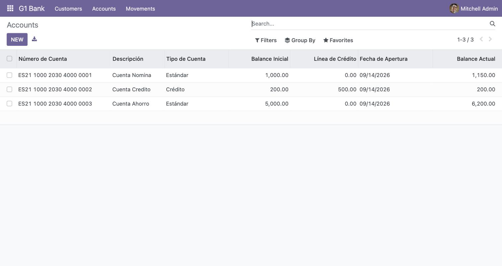
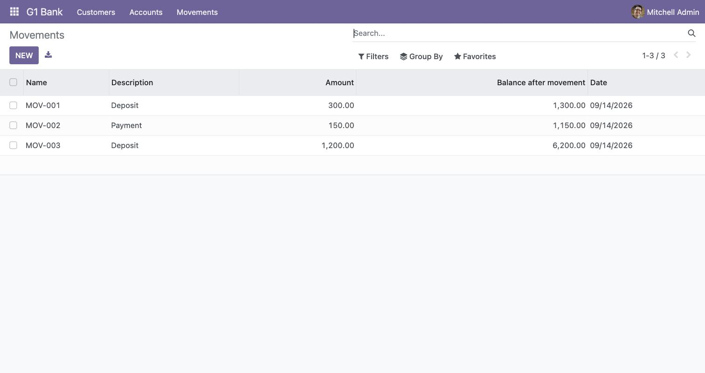
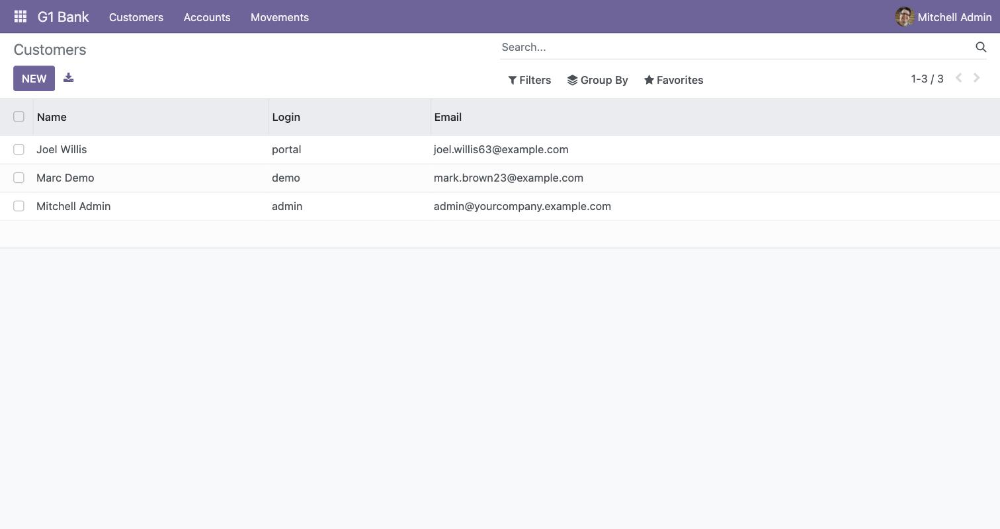

# G1 Bank — Módulo de gestión bancaria para Odoo 16

Módulo de Odoo 16 que implementa una gestión bancaria sencilla: **cuentas**,
**movimientos** y **clientes**. Fue desarrollado como proyecto formativo para
practicar el modelo de datos, las vistas y las reglas de negocio de Odoo.

> ℹ️ **Proyecto de equipo.** Este módulo se desarrolló en grupo (ver
> [Créditos](#créditos)). Esta copia recopila el trabajo, lo documenta y corrige
> algunos problemas de instalación para el portfolio personal.

## Funcionalidades

- **Cuentas (`g1.account`)**
  - Tipos de cuenta: **Estándar** y **Crédito**.
  - Balance inicial, línea de crédito y balance actual (solo lectura).
  - Validaciones: el balance inicial no puede ser negativo; una cuenta
    estándar no puede tener línea de crédito; el número de cuenta, el balance
    inicial y el tipo no se pueden modificar una vez creada la cuenta.
- **Movimientos (`g1.movement`)**
  - Tipos: **Depósito** (`deposit`) y **Pago** (`payment`).
  - Recalcula automáticamente el balance de la cuenta asociada.
  - En pagos valida saldo suficiente (incluida la línea de crédito si aplica).
  - Los movimientos son **inmutables**: no se pueden editar una vez creados.
- **Clientes**
  - Se modelan sobre `res.users`, con vistas de árbol y formulario propias.

## Estructura

```
g1_bank/
├── __manifest__.py            # Metadatos y ficheros de datos del módulo
├── models/
│   ├── account.py             # Modelo g1.account (cuentas)
│   └── movement.py            # Modelo g1.movement (movimientos)
├── security/
│   └── ir.model.access.csv    # Permisos de acceso
└── views/
    ├── views.xml              # Menús, acciones y vistas tree
    └── g1_bank_customer.xml   # Vistas tree/form de clientes (res.users)
```

## Requisitos

- Odoo 16
- Python 3.8+ (el que use tu instalación de Odoo)

## Instalación

1. Copia la carpeta `g1_bank` dentro del directorio de *addons* de tu Odoo.
2. Añade esa ruta a `addons_path` en tu fichero de configuración de Odoo.
3. Arranca Odoo con actualización de la lista de aplicaciones:
   ```bash
   ./odoo-bin -c odoo.conf -u all -d <tu_base_de_datos>
   ```
4. En Odoo, activa el **modo desarrollador**, ve a *Aplicaciones*, actualiza la
   lista y busca **"My Bank (G1 Bank)"** para instalarlo.
5. Aparecerá el menú **G1 Bank** con las secciones *Accounts*, *Movements* y
   *Customers*.

> **Nota:** el módulo se ha **instalado y probado en una instancia real de
> Odoo 16** (contenedor Docker `odoo:16` + PostgreSQL), instalándose sin errores
> y con la lógica de negocio verificada (recálculo de balance en cada
> movimiento). Ver [Capturas](#capturas).

## Capturas

Módulo instalado y funcionando en una instancia real de **Odoo 16** (con datos
de ejemplo).

**Cuentas** — tipos estándar/crédito, balance inicial, línea de crédito y balance actual:



**Movimientos** — depósitos y pagos con el balance recalculado tras cada movimiento:



**Clientes** — basados en `res.users`:



## Créditos

Proyecto de equipo desarrollado por:

- **Daniel López López** ([@daaniidam](https://github.com/daaniidam))
- Chad
- Imad

## Licencia

Distribuido bajo licencia [MIT](LICENSE).
